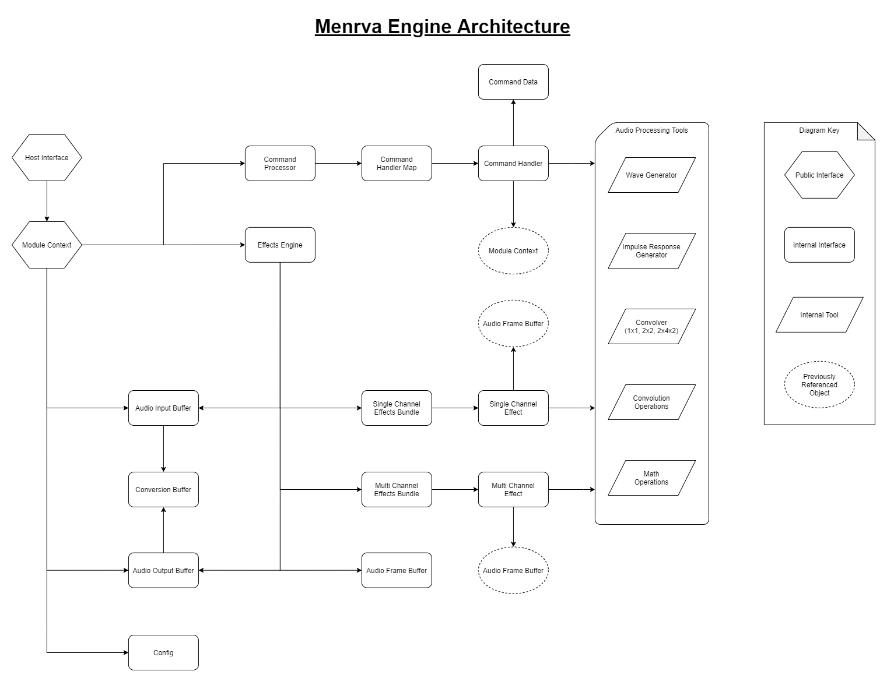

# Engine Architecture Details

## Objects
- [Host Interface](#Host-Interface)
- [Module Context](#Module-Context)
- [Command Processor](#Command-Processor)
- [Effects Engine](#Effects-Engine)
- [Effects Bundles](#Effects-Bundles)

## Host Interface
Provides the necessary Public Interface for integration into a Host Environment such as Android, iOS, Windows, Mac, etc.

Implementations : [AndroidInterface](../../hosts/android/src/app/src/main/cpp/AndroidInterface.h)

## Module Context
Provides pointers to the necessary Objects for an instance of Menrva to function.  The ModuleContext referenced below can be extended in order to add Host Specific details.

Implementations : [ModuleContext](../src/host/ModuleStructures.h), [AndroidModuleContext](../../hosts/android/src/app/src/main/cpp/AndroidStructures.h)

## Command Processor
Provides a Command Based Interface for interacting with a Menrva Instance.  Host Specific Command Handlers can be injected into the Command Processor by adding them to the HandlerMap contained in the CommandHandlerMap (example can be found in [AndroidInterface](../../hosts/android/src/app/src/main/cpp/AndroidInterface.h)).

Implementation : [CommandProcessor](../src/engine/CommandProcessor.h)

## Effects Engine
Provides the actual DSP Effects Engine functionality.  Contains instances of Single- & Multi-Channel Effects Bundles and manages the Audio Processing Pipeline. 

Implementation : [EffectsEngine](../src/engine/EffectsEngine.h)

## Effects Bundles
Provides wrappers for classifying different kinds of Audio Effects based on their necessary inputs.  Single-Channel Effects will be provided only a single channel of input to process at a time.  Multi-Channel Effects will be provided with all channels of input to process.  When adding new effects they must be included in one of these two Effect Bundles for the Engine to include them in processing.

Implementations : [SingleChannelEffectsBundle](../src/effects/SingleChannelEffectsBundle.h), [MultiChannelEffectsBundle](../src/effects/MultiChannelEffectsBundle.h)
